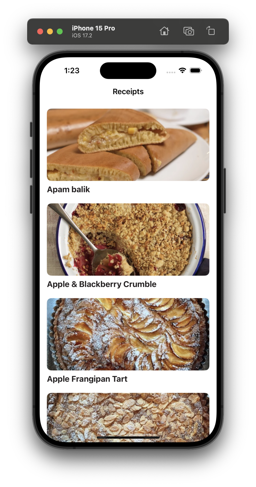
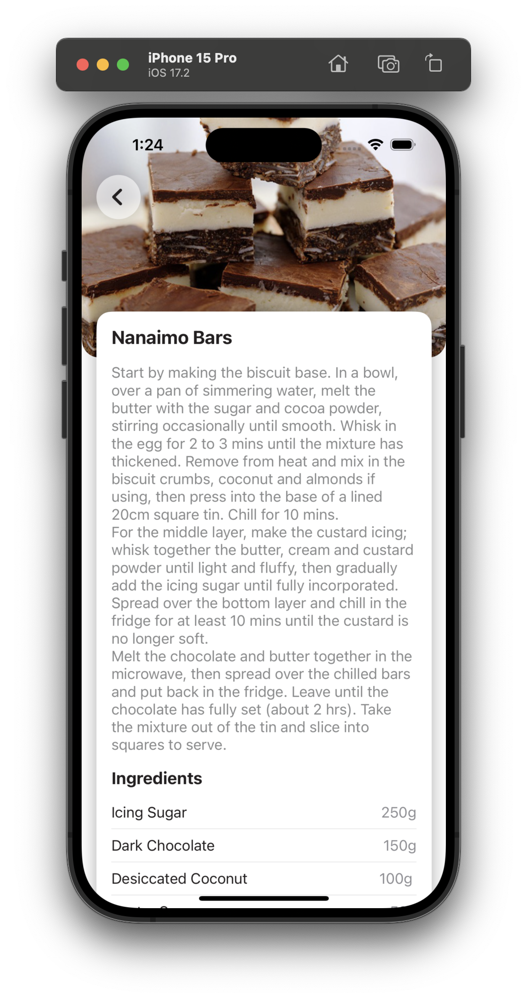
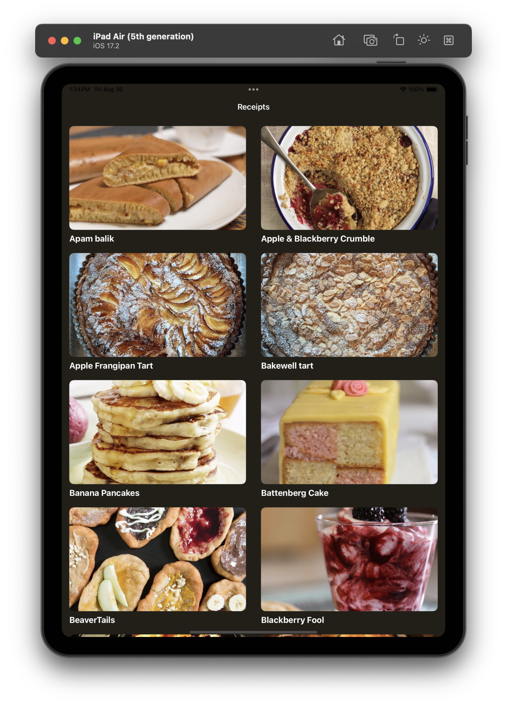
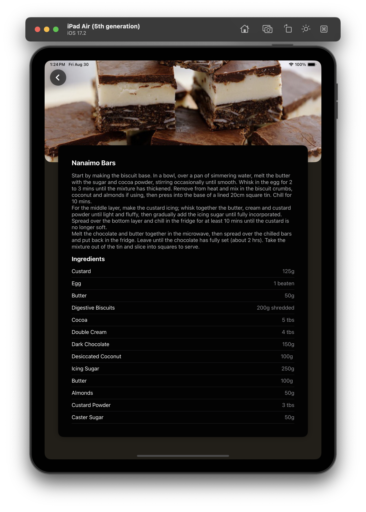

# MyRecipeBook

## Description

**MyRecipeBook** is a native iOS application that allows users to explore a variety of dessert recipes. With a clean and intuitive interface, the app offers a seamless browsing experience for discovering new recipes and learning how to prepare delicious meals. The app supports both light and dark mode and is fully optimized for both iPhone and iPad devices.

## Features

- **List Dessert Recipes**: View a list of dessert recipes sorted alphabetically to easily find your next treat.
- **Detailed Recipe View**: Get comprehensive details about each recipe, including the meal name, step-by-step instructions, ingredients, and measurements.
- **Light and Dark Mode Support**: Enjoy the app in both light and dark modes to suit your environment and preferences.
- **Optimized for iPhone and iPad**: The app is designed to provide a great user experience on both iPhone and iPad devices.

## API Integration

The app integrates with the public API from [TheMealDB](https://themealdb.com/api.php) to fetch up-to-date recipe data.

## Screenshots

  
  

  
  

